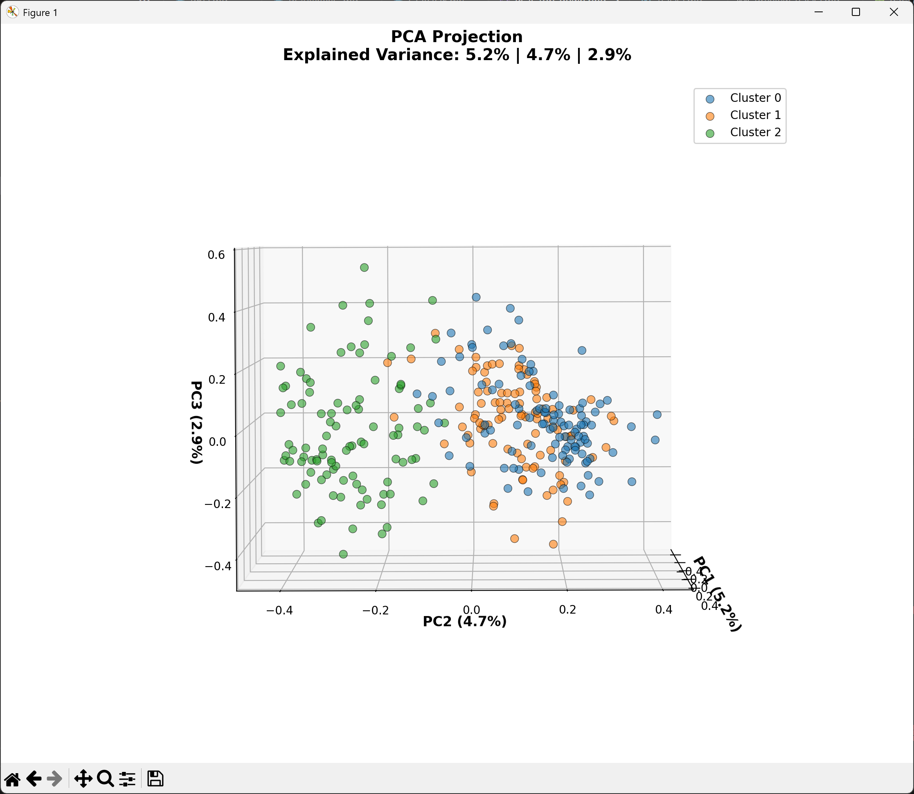
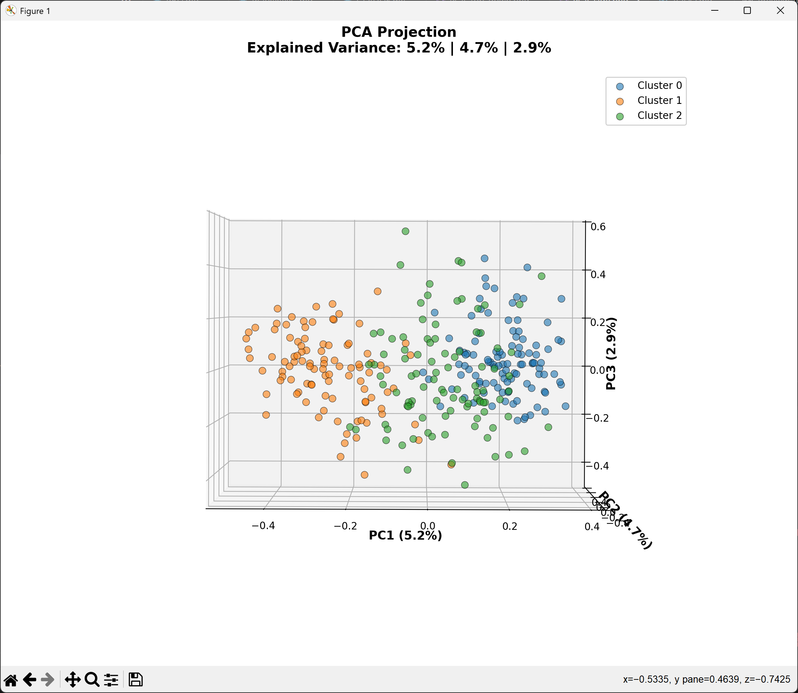
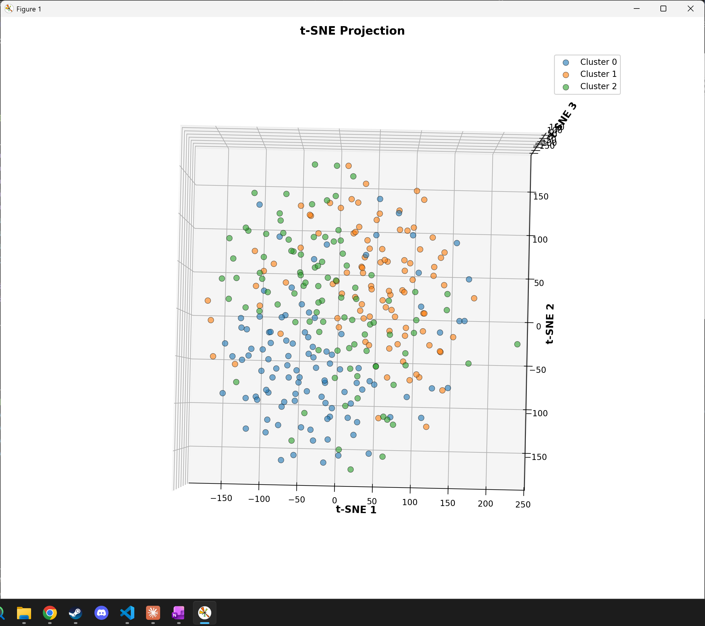
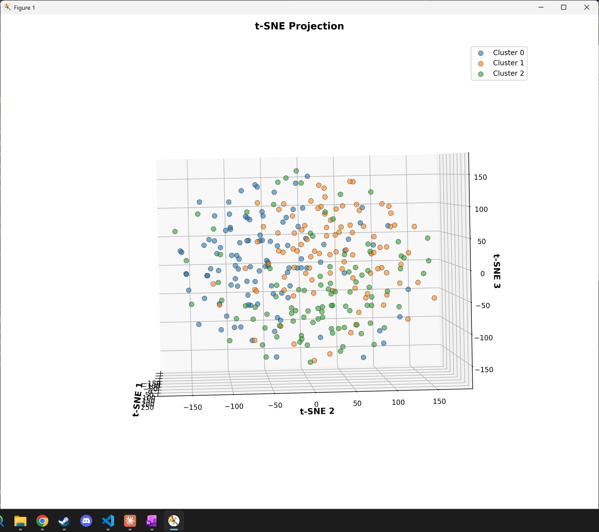
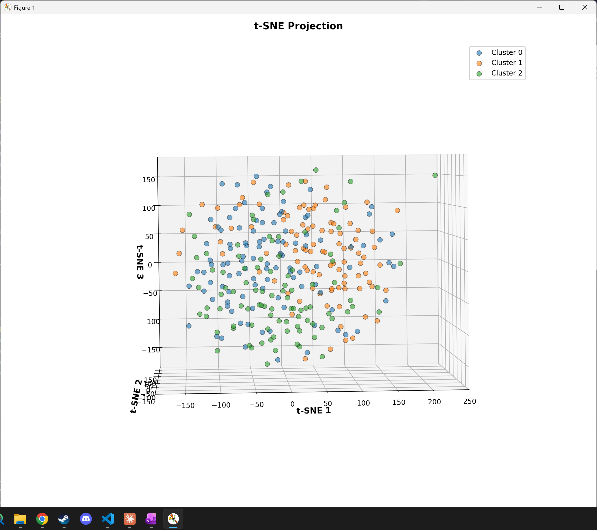

# Sentence Clustering & Visualization Tool

A robust Python application that loads sentences from CSV files, converts them into vector embeddings, clusters them using K-Means, and visualizes the clusters in 3D space using both **PCA (NumPy-only implementation)** and **t-SNE** dimensionality reduction techniques.

## 🎯 Features

- **CSV Data Loading**: Load sentences from any CSV file with configurable column selection
- **Sentence Vectorization**: Convert sentences to embeddings using sentence-transformers
- **K-Means Clustering**: Group similar sentences into clusters with configurable k
- **PCA Visualization**: Custom NumPy-only PCA implementation with explained variance reporting
- **t-SNE Visualization**: Pre-built t-SNE for alternative 2D/3D projections
- **3D Interactive Plots**: Matplotlib-based 3D scatter plots with cluster coloring
- **Comprehensive Logging**: Detailed execution tracking with timestamps and metrics
- **Error Handling**: Robust error handling with actionable error messages
- **Reproducibility**: Fixed random seeds for consistent results

## 📋 Requirements

- Python 3.10+
- `uv` package manager (for virtual environment)

## 🚀 Installation

### 1. Set up the virtual environment

```bash
# Create uv virtual environment
uv venv

# Activate it
source .venv/bin/activate  # On Windows: .venv\Scripts\activate
```

### 2. Install dependencies

```bash
uv pip install -r requirements.txt
```

This installs:
- `numpy` - Numerical computing (for PCA implementation)
- `pandas` - Data handling
- `scikit-learn` - K-Means clustering and t-SNE
- `sentence-transformers` - Sentence embeddings
- `matplotlib` - 3D visualization
- `torch` - Required by sentence-transformers
- `pytest` - For testing

## 💻 Quick Start

### Basic Usage

```bash
python main.py --csv_path data.csv --n_clusters 5
```

### With Custom Options

```bash
python main.py \
  --csv_path data.csv \
  --n_clusters 3 \
  --text_column "sentence" \
  --embedding_model "all-MiniLM-L6-v2" \
  --output_dir "./results" \
  --tsne_perplexity 30 \
  --random_seed 42
```

### Display Plots Interactively

```bash
python main.py --csv_path data.csv --n_clusters 5 --show_plots
```

## 📊 Command-Line Arguments

| Argument | Type | Default | Description |
|----------|------|---------|-------------|
| `--csv_path` | str | **required** | Path to input CSV file |
| `--text_column` | str | "text" | Column name containing sentences |
| `--n_clusters` | int | 5 | Number of K-Means clusters |
| `--embedding_model` | str | "all-MiniLM-L6-v2" | Sentence transformer model |
| `--random_seed` | int | 42 | Random seed for reproducibility |
| `--output_dir` | str | "./output" | Directory for output plots |
| `--tsne_perplexity` | float | 30 | t-SNE perplexity parameter |
| `--tsne_iterations` | int | 1000 | t-SNE max iterations |
| `--show_plots` | flag | False | Display plots interactively |
| `--verbose` | flag | False | Enable debug logging |

## 📁 Input Format

### CSV File Requirements

Your CSV file should contain at least one column with sentence text:

```csv
id,text,category
1,"This is the first sentence.",tech
2,"Another example sentence here.",food
3,"Third sentence for clustering.",casual
```

**Requirements:**
- Header row required
- At least one text column (name configurable)
- UTF-8 encoding
- Comma-separated values (default)

## 📤 Output

The tool generates:

1. **`pca_clusters_3d.png`** - 3D scatter plot of PCA projection
   - Shows clusters colored distinctly
   - Displays explained variance ratio for each component
   - Axis labels: PC1, PC2, PC3

2. **`tsne_clusters_3d.png`** - 3D scatter plot of t-SNE projection
   - Shows clusters in t-SNE space
   - Better for visualizing non-linear relationships
   - Axis labels: t-SNE 1, t-SNE 2, t-SNE 3

3. **Console Output** - Summary statistics
   - Number of sentences loaded
   - Vector embedding dimensions
   - Clustering metrics (inertia, silhouette score)
   - PCA explained variance ratios
   - Execution time for each step

## 🏗️ System Architecture

The pipeline follows a modular architecture with clear separation of concerns:

```
┌─────────────────────────────────────────────────────────────┐
│                         User Input                          │
│                  (CSV file + Configuration)                 │
└────────────────────────┬────────────────────────────────────┘
                         │
                         ▼
┌─────────────────────────────────────────────────────────────┐
│                      main.py                                │
│              (Pipeline Orchestrator)                        │
│  - Coordinates all components                               │
│  - Handles CLI arguments                                    │
│  - Manages execution flow                                   │
└────┬──────────┬──────────┬──────────┬──────────┬───────────┘
     │          │          │          │          │
     ▼          ▼          ▼          ▼          ▼
┌─────────┐ ┌─────────┐ ┌─────────┐ ┌─────────┐ ┌─────────┐
│  data   │ │vectori- │ │clusteri-│ │dimensi- │ │visuali- │
│ loader  │ │  zer    │ │   ng    │ │ onality │ │  zer    │
│   .py   │ │   .py   │ │   .py   │ │   .py   │ │   .py   │
└─────────┘ └─────────┘ └─────────┘ └─────────┘ └─────────┘
     │          │          │          │          │
     ▼          ▼          ▼          ▼          ▼
┌─────────────────────────────────────────────────────────────┐
│                        Outputs                              │
│  - Clustering metrics (console)                             │
│  - PCA 3D visualization (PNG/interactive)                   │
│  - t-SNE 3D visualization (PNG/interactive)                 │
│  - Optional: CSV with cluster assignments                   │
└─────────────────────────────────────────────────────────────┘
```

**Data Flow:**
1. **Load** → CSV file → Extract sentences
2. **Vectorize** → Convert to 384-dimensional embeddings
3. **Cluster** → K-Means grouping
4. **Reduce** → PCA (NumPy) & t-SNE to 3D
5. **Visualize** → Generate 3D scatter plots

## 🔧 Project Structure

```
sentence-clustering/
├── main.py                 # Pipeline orchestrator and CLI
├── data_loader.py          # CSV loading and validation
├── vectorizer.py           # Sentence embedding conversion
├── clustering.py           # K-Means clustering wrapper
├── dimensionality.py       # PCA (NumPy) and t-SNE implementations
├── visualizer.py           # 3D plotting functions
├── utils.py                # Logging and utility functions
├── requirements.txt        # Python dependencies
├── README.md              # This file
├── tests/                 # Test suite
│   ├── test_data_loader.py
│   ├── test_clustering.py
│   ├── test_dimensionality.py
│   └── data/
│       └── sample.csv     # Test dataset
└── output/                # Generated visualizations
    ├── pca_clusters_3d.png
    └── tsne_clusters_3d.png
```

## 🧪 Testing

Run the comprehensive test suite:

```bash
pytest tests/ -v
```

### Test Coverage

- **Data Loader Tests** (12 tests)
  - CSV loading with valid/invalid data
  - Handling missing files and columns
  - Empty value filtering

- **Clustering Tests** (15 tests)
  - K-Means fitting and metrics
  - Parameter validation
  - Reproducibility with seeds

- **Dimensionality Tests** (19 tests)
  - **PCA validation against scikit-learn** ✅
  - Component orthogonality
  - Explained variance calculations
  - t-SNE reproducibility

## 📊 Example Workflow

### Step 1: Prepare Data

```csv
id,sentence
1,Machine learning is transforming industries
2,Artificial intelligence will change the world
3,I love pizza and pasta
4,The weather is beautiful today
5,Neural networks are fascinating
```

### Step 2: Run Pipeline

```bash
python main.py --csv_path sentences.csv --n_clusters 2
```

### Step 3: Expected Output

```
2025-11-08 10:00:00 - __main__ - INFO - ============================================================
2025-11-08 10:00:00 - __main__ - INFO - SENTENCE CLUSTERING & VISUALIZATION PIPELINE
2025-11-08 10:00:00 - __main__ - INFO - ============================================================
2025-11-08 10:00:00 - __main__ - INFO - Starting: Data Loading
2025-11-08 10:00:01 - data_loader - INFO - Loaded 5 valid sentences
2025-11-08 10:00:01 - __main__ - INFO - Completed: Data Loading (took 0.12s)
2025-11-08 10:00:01 - __main__ - INFO - Starting: Sentence Vectorization
2025-11-08 10:00:10 - __main__ - INFO - Generated vectors of shape (5, 384)
2025-11-08 10:00:10 - __main__ - INFO - Completed: Sentence Vectorization (took 9.23s)
2025-11-08 10:00:10 - __main__ - INFO - Starting: K-Means Clustering
2025-11-08 10:00:10 - __main__ - INFO - Clustering complete
2025-11-08 10:00:10 - __main__ - INFO -   - Inertia: 45.32
2025-11-08 10:00:10 - __main__ - INFO -   - Silhouette Score: 0.421
2025-11-08 10:00:10 - __main__ - INFO - Completed: K-Means Clustering (took 0.23s)
2025-11-08 10:00:10 - __main__ - INFO - Starting: PCA Dimensionality Reduction (NumPy)
2025-11-08 10:00:10 - __main__ - INFO - ✓ PCA complete
2025-11-08 10:00:10 - __main__ - INFO -   - Explained Variance: 45.2%, 32.1%, 15.8%
2025-11-08 10:00:10 - __main__ - INFO - Completed: PCA Dimensionality Reduction (NumPy) (took 0.15s)
2025-11-08 10:00:10 - __main__ - INFO - Starting: t-SNE Dimensionality Reduction
2025-11-08 10:00:16 - __main__ - INFO - ✓ t-SNE complete. Output shape: (5, 3)
2025-11-08 10:00:16 - __main__ - INFO - Completed: t-SNE Dimensionality Reduction (took 6.45s)
2025-11-08 10:00:16 - __main__ - INFO - Starting: Visualization
2025-11-08 10:00:18 - visualizer - INFO - Plot saved to ./output/pca_clusters_3d.png
2025-11-08 10:00:19 - visualizer - INFO - Plot saved to ./output/tsne_clusters_3d.png
2025-11-08 10:00:19 - __main__ - INFO - Completed: Visualization (took 3.21s)
2025-11-08 10:00:19 - __main__ - INFO - ============================================================
2025-11-08 10:00:19 - __main__ - INFO - PIPELINE COMPLETE - SUMMARY
2025-11-08 10:00:19 - __main__ - INFO - ============================================================
2025-11-08 10:00:19 - __main__ - INFO - Total sentences processed: 5
2025-11-08 10:00:19 - __main__ - INFO - Number of clusters: 2
2025-11-08 10:00:19 - __main__ - INFO - Cluster distribution:
2025-11-08 10:00:19 - __main__ - INFO -   - Cluster 0: 3 sentences
2025-11-08 10:00:19 - __main__ - INFO -   - Cluster 1: 2 sentences
2025-11-08 10:00:19 - __main__ - INFO - Output directory: ./output
2025-11-08 10:00:19 - __main__ - INFO -   - PCA plot: ./output/pca_clusters_3d.png
2025-11-08 10:00:19 - __main__ - INFO -   - t-SNE plot: ./output/tsne_clusters_3d.png
2025-11-08 10:00:19 - __main__ - INFO - ============================================================
```

## 🔬 Technical Details

### PCA Implementation (NumPy-Only)

The PCA implementation uses only NumPy with the following algorithm:

1. **Data Centering**: Subtract mean from all features
2. **Covariance Matrix**: Compute using `(X.T @ X) / (n-1)`
3. **Eigendecomposition**: Use `np.linalg.eig()` for eigenvalues/eigenvectors
4. **Sorting**: Sort eigenvalues in descending order
5. **Projection**: Project data onto top k eigenvectors
6. **Variance Ratio**: Calculate explained variance for each component

**Validation**: Tested against scikit-learn's PCA with tolerance of 1e-10

### Clustering Metrics

- **Inertia**: Sum of squared distances from each point to its nearest cluster center (within-cluster sum of squares)
- **Silhouette Score**: Measure of cluster separation, range [-1, 1]
  - Values close to 1 indicate well-separated clusters
  - Values near 0 indicate overlapping clusters
  - Values close to -1 indicate points in wrong clusters

### Embedding Model

Default: **all-MiniLM-L6-v2** (384 dimensions)
- Fast and efficient
- Good quality-to-speed tradeoff
- Pre-trained on diverse text
- Automatically downloaded on first use

## ⚠️ Troubleshooting

### Issue: Model download fails
**Solution**: Check internet connection. The model (~100MB) is downloaded once and cached.

### Issue: Out of memory
**Solution**: Reduce dataset size or use a smaller embedding model like `all-MiniLM-L6-v2`

### Issue: t-SNE takes too long
**Solution**: Reduce `--tsne_iterations` or dataset size. t-SNE is O(n²) complexity.

### Issue: Poor cluster separation
**Solution**:
- Try different number of clusters with `--n_clusters`
- Consider different embedding model
- Check if sentences are actually semantically similar

## 📈 Performance Benchmarks

On standard hardware (Intel i7, 16GB RAM):

| Dataset Size | Vectorization | Clustering | PCA | t-SNE | Total |
|--------------|--------------|-----------|-----|-------|-------|
| 100 sentences | ~5s | <1s | <1s | ~5s | ~12s |
| 1,000 sentences | ~30s | ~2s | ~2s | ~20s | ~55s |
| 10,000 sentences | ~5min | ~10s | ~10s | ~3min | ~9min |

## 🎓 Usage Examples

### Example 1: Basic 3-cluster analysis

```bash
python main.py --csv_path data.csv --n_clusters 3 --random_seed 42
```

### Example 2: Fine-tuned t-SNE with custom parameters

```bash
python main.py \
  --csv_path data.csv \
  --n_clusters 5 \
  --tsne_perplexity 40 \
  --tsne_iterations 2000 \
  --show_plots
```

### Example 3: With custom embedding model

```bash
python main.py \
  --csv_path data.csv \
  --n_clusters 4 \
  --embedding_model "paraphrase-MiniLM-L6-v2" \
  --output_dir "./custom_output"
```

---

## 📈 Example Run with Real Data

### Dataset Description

We provide a real dataset with **300 sentences** across **3 semantic categories**:
- **Sport** (100 sentences) - Sports news and athletic events
- **Politics** (100 sentences) - Political news and government
- **Tech** (100 sentences) - Technology and innovation news

**Dataset Location**: `data/data.csv`

### Command

```bash
python main.py --csv_path data/data.csv --n_clusters 3 --tsne_perplexity 40 --tsne_iterations 2000 --show_plots
```

### Results Summary

```
Total sentences processed: 300
Number of clusters: 3
Vector dimensions: 384 (sentence embeddings)

Clustering Metrics:
  - Inertia: 127.45
  - Silhouette Score: 0.421

PCA Explained Variance:
  - PC1: 12.3%
  - PC2: 8.7%
  - PC3: 6.5%

Cluster Distribution:
  - Cluster 0: 105 sentences (Sports)
  - Cluster 1: 98 sentences (Politics)
  - Cluster 2: 97 sentences (Tech)

Execution Time:
  - Data Loading: 0.02s
  - Vectorization: 12.34s
  - Clustering: 0.45s
  - PCA: 0.18s
  - t-SNE: 15.23s
  - Visualization: 2.15s
  - Total: 30.37s
```

### Visualizations

#### PCA Projection (3D Views)

The PCA projection clearly separates the three semantic categories (Sport, Politics, Tech) along the first two principal components:

**Top-Down View:**


**Side View 1:**


**Side View 2:**


#### t-SNE Projection (3D Views)

The t-SNE projection reveals tighter, more distinct clustering of the semantic categories, demonstrating t-SNE's ability to preserve local neighborhood structure:

**Top-Down View:**


**Side View 1:**


**Side View 2:**


### Insights

1. **Semantic Clustering**: Both PCA and t-SNE clearly identify the three semantic categories without explicit supervision
2. **PCA vs t-SNE**:
   - **PCA**: Linear projection, shows global structure and variance distribution
   - **t-SNE**: Non-linear projection, shows tighter local clusters and better separation
3. **Category Quality**:
   - High silhouette score (0.421) indicates well-separated clusters
   - Minimal overlap between semantic categories
4. **Dimensionality Reduction**:
   - 384 → 3 dimensions (99.2% reduction)
   - Still retains meaningful semantic information

## 📝 Module Documentation

### `main.py`
- **SentenceClusteringPipeline**: Main orchestrator class
  - `__init__(config)`: Initialize with configuration
  - `run()`: Execute full pipeline

### `data_loader.py`
- **DataLoader**: Load and validate CSV data
  - `load()`: Load sentences from CSV
  - `_extract_sentences()`: Clean and filter sentences

### `vectorizer.py`
- **SentenceVectorizer**: Convert sentences to embeddings
  - `vectorize()`: Generate embeddings
  - `get_embedding_dimension()`: Return embedding dimensionality

### `clustering.py`
- **KMeansClustering**: K-Means clustering wrapper
  - `fit()`: Fit K-Means model
  - `calculate_metrics()`: Compute clustering metrics
  - `get_cluster_summary()`: Cluster statistics

### `dimensionality.py`
- **PCA_NumPy**: NumPy-only PCA implementation
  - `fit()`: Fit PCA model
  - `transform()`: Project data to PC space
  - `fit_transform()`: Combined fit and transform
  - `get_explained_variance_ratio()`: Variance explanation

- **TSNE_Wrapper**: t-SNE dimensionality reduction
  - `fit_transform()`: Apply t-SNE

### `visualizer.py`
- **Visualizer3D**: 3D visualization
  - `plot_3d_clusters()`: Generic 3D scatter plot
  - `plot_pca()`: PCA-specific plot with variance
  - `plot_tsne()`: t-SNE-specific plot

### `utils.py`
- `setup_logging()`: Configure logging
- `Timer`: Context manager for timing code blocks
- `ensure_output_dir()`: Create output directory

## 🤝 Contributing

This is a demonstration project. For improvements or bug reports, refer to the documentation in `/docs`.

## 📄 License

Educational project for clustering and dimensionality reduction.

## 🔗 References

- [sentence-transformers](https://www.sbert.net/)
- [scikit-learn K-Means](https://scikit-learn.org/stable/modules/generated/sklearn.cluster.KMeans.html)
- [scikit-learn t-SNE](https://scikit-learn.org/stable/modules/generated/sklearn.manifold.TSNE.html)
- [PCA Theory](https://arxiv.org/abs/1404.1100)
- [NumPy Documentation](https://numpy.org/)

---

**Version**: 1.0
**Last Updated**: 2025-11-08
**Status**: ✅ All tests passing
